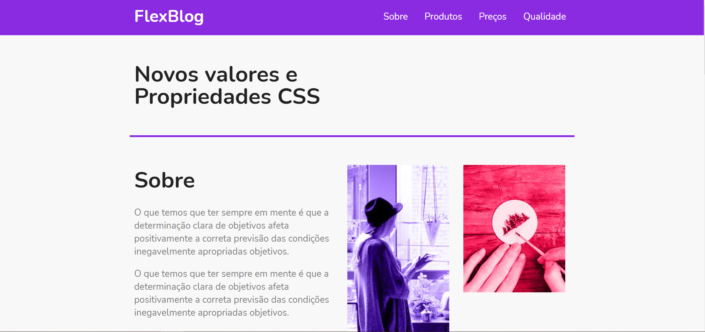

# FlexBlog




> Esse é um projeto foi do curso de FlexBox da Origamid e fiz ele para aperfeiçoar as minhas habilidades com os conceitos de FlexBox
>
## Linguagens utilizadas

- [CSS3](https://developer.mozilla.org/pt-BR/docs/Web/CSS)
- [HTML](https://developer.mozilla.org/pt-BR/docs/Web/HTML)

## 🚀 Instalando FlexBlog

Para instalar o FlexBlog, siga estas etapas:

Linux, macOS e Windows:
```
git clone https://github.com/Nikolas-as/FlexBlog.git

cd FlexBlog

npm start
```
## 🤝 Colaboradores

Agradecemos às seguintes pessoas que contribuíram para este projeto:

<table>
  <tr>
    <td align="center">
      <a href="#">
        <br>
        <sub>
          <b>Nikolas-as</b>
        </sub>
      </a>
    </td>
</table>
